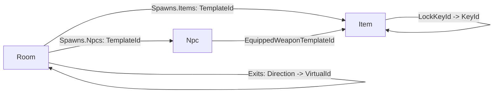

# Area File Web Editor

## Goal

One self-contained file, `tools/area-editor.html` (inline CSS + JS, zero dependencies), to build and edit a single ConsoleMud area file at a time. It edits the `AreaBlueprint` shape used by [`ConsoleMud/Areas/emerald_forest.json`](ConsoleMud/Areas/emerald_forest.json): area metadata plus `ItemTemplates`, `NpcTemplates`, and `Rooms`. It opens with the two existing areas embedded as loadable examples, supports New/Upload, and downloads a minimal, game-loadable JSON file.

## Data model and cross-references

Schemas derived from [`ConsoleMud/Entities/AreaBlueprint.cs`](ConsoleMud/Entities/AreaBlueprint.cs), [`ItemBlueprint.cs`](ConsoleMud/Entities/ItemBlueprint.cs), [`NpcBlueprint.cs`](ConsoleMud/Entities/NpcBlueprint.cs), [`RoomBlueprint.cs`](ConsoleMud/Entities/RoomBlueprint.cs), [`Spawning.cs`](ConsoleMud/Entities/Spawning.cs).

## Layout

- Header: area picker (`New empty area`, `Load example` dropdown of the two embedded areas, `Upload`), area name display, `Download area` button.
- Tab bar: `Area Info`, `Items`, `NPCs`, `Rooms`, `Map`.
- Array tabs (Items/NPCs/Rooms): left = entry list (select / add / duplicate / delete); right = typed form.
- `Area Info`: single form for `Name`, `Description`, and an optional preserved `Author` field (present in emerald_forest.json; ignored by the loader but kept on round-trip).
- Non-blocking warnings panel under the header.

## Schemas and enums

- Item: `VirtualId`, `Name`, `Description`(textarea), booleans (`IsGetable`, `IsContainer`, `IsCloseable`, `StartsLocked`, `IsLightSource`, `GrantsDarkvision`, `IsWeapon`, `IsArmor`, `IsEquippable`, `IsShield`), `WeaponType`(enum), `DiceNotation`, `AttackVerbs`(string list), `ArmorRating`(int), `TargetSlot`(enum), `LockKeyId`, `KeyId`.
- NPC: `VirtualId`, `Name`, `Description`, `Health`, `MaxHealth`, `Level`(default 1), `XpReward`, `EquippedWeaponTemplateId`(item ref), `IsAggressive`, `HasDarkvision`, `Archetypes`(multi-enum).
- Room: `VirtualId`, `Name`, `Description`, `Exits`(direction -> room rows), `Spawns`(Items/Npcs template+count rows), `IsOutside`, `IsDark`.
- Enums: Direction [North, South, East, West, Up, Down]; EquipmentSlot (from [`EquipmentSlot.cs`](ConsoleMud/Enums/EquipmentSlot.cs)); WeaponType (from [`WeaponType.cs`](ConsoleMud/Enums/WeaponType.cs)); Archetype (from [`Archetype.cs`](ConsoleMud/Enums/Archetype.cs)).

## Field widgets

Reuse the schema-driven renderer approach from `tools/definitions-editor.html`: `text`, `textarea`, `int`, `bool`(checkbox), `enum`(select with `(none)` for optional), `stringList`(AttackVerbs), `multiEnum`(Archetypes). Two specialized editors:
- Exits: rows of `Direction` select + target-room select (populated from this area's rooms), with an "auto-add reciprocal exit" toggle (N<->S, E<->W, Up<->Down) that also writes the opposite exit on the target room.
- Spawns: two row lists (Items, Npcs) each = template select (from item/NPC templates) + `Count` int.

## Cross-file behavior and validation

- Dropdowns: exit targets from rooms; spawn `TemplateId` from item/NPC templates; NPC `EquippedWeaponTemplateId` from items. Free-text fallback with a flagged "(unknown)" option when a referenced id is missing.
- Warnings (non-blocking): duplicate/empty `VirtualId` within items/NPCs/rooms; exit pointing to a missing room; spawn/equipped-weapon referencing a missing template; `LockKeyId` with no matching item `KeyId`.

## Room map (read-only)

`Map` tab renders an SVG grid layout: start from the first room at origin, place exit neighbors by direction deltas (N/S/E/W on the plane; Up/Down shown as badges), offsetting on collision. Nodes show room name; edges drawn for exits. Clicking a node selects that room and switches to the `Rooms` tab.

## Serialization (minimal style)

Matches emerald_forest.json conventions, 2-space indent:
- Always include `VirtualId`/`Name`/`Description`; NPC `Health`/`MaxHealth`.
- Booleans included only when `true`; strings/arrays only when non-empty; `ArmorRating` only when non-zero; NPC `Level` only when `!= 1`; `XpReward` only when `> 0`.
- Room `Exits`/`Spawns` omitted when empty; when present, `Spawns` keeps `Items` and `Npcs` arrays.
- Download filename derived from area name (e.g. `the_emerald_forest.json`).

## Embedded seed

A `const SEED_AREAS = { emerald_forest: {...}, fanatics_tower: {...} }` snapshot of the two current area files powers the examples picker; a short comment notes it is a static snapshot.

## Implementation order

Shell + schemas first, then the generic renderer and specialized exit/spawn editors, then list/CRUD, then cross-references + validation, then the room map, then minimal serialization + upload/download.