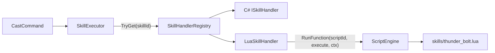

# Layer 2 — Script-backed Skill Handlers

## Prerequisite
Layer 1 (Foundation) must be complete. `ScriptEngine.Load` is called in `Program.cs` and all `Scripts/skills/*.lua` files are already loaded and cached.

## How it fits into the existing pipeline



The call path is unchanged from the C# handler path. `SkillExecutor` calls `handler.Execute(context)` — it does not know or care whether the handler is C# or Lua.

## New files

### `ConsoleMud/Core/Scripting/LuaSkillContext.cs`

A MoonSharp-registered proxy that wraps `SkillContext` and exposes only safe, Lua-friendly values. `LuaSkillHandler.Execute` constructs this and passes it to the script.

```csharp
[MoonSharpUserData]
public class LuaSkillContext
{
    public string caster_id   { get; }  // Caster.Id.ToString()
    public string target_id   { get; }  // resolved NPC target Id, or null
    public string target_name { get; }  // raw arg string, e.g. "wolf"
    public int    spell_power { get; }  // ctx.SpellPowerBonus()
    public int    heal_bonus  { get; }  // ctx.HealScaleBonus()
    public double param(string key) => ...  // ctx.Param(key)
}
```

`target_id` is pre-resolved via `ctx.ResolveNpcTarget()` — if that returns null (no target in combat or room), the field is `null` in Lua. The script must guard against this:

```lua
if ctx.target_id == nil then
    game.print("No target.")
    return
end
```

The `[MoonSharpUserData]` attribute auto-registers the type; no manual `UserData.RegisterType` call needed in `ScriptEngine`.

### `ConsoleMud/Core/Scripting/LuaSkillHandler.cs`

Implements `ISkillHandler`. Delegates to `ScriptEngine.RunFunction`.

```csharp
public class LuaSkillHandler : ISkillHandler
{
    public string SkillId { get; }
    private readonly string _scriptId; // e.g. "skills/thunder_bolt"

    public LuaSkillHandler(string skillId, string scriptId)
    { SkillId = skillId; _scriptId = scriptId; }

    public void Execute(SkillContext ctx)
    {
        var luaCtx = new LuaSkillContext(ctx);
        ScriptEngine.RunFunction(_scriptId, "execute", luaCtx);
    }
}
```

### `Scripts/skills/thunder_bolt.lua` (example)

Demonstrates the full contract. A real `thunder_bolt` entry must also exist in `skills.json` for cost/cooldown/proficiency — the script only provides the effect.

```lua
skill_id = "thunder_bolt"

function execute(ctx)
    if ctx.target_id == nil then
        game.print("Strike what with lightning?")
        return
    end
    local dmg = game.roll_dice("2d6") + ctx.spell_power
    game.damage(ctx.target_id, dmg)
    game.print("{YA bolt of lightning arcs into " .. ctx.target_name .. " for "
               .. dmg .. " damage!{x")
end
```

## Modified files

### [`ConsoleMud/Core/Skills/SkillHandlerRegistry.cs`](ConsoleMud/ConsoleMud/Core/Skills/SkillHandlerRegistry.cs)

Add a public `RegisterScriptedSkills()` method (called from `Program.cs` after `ScriptEngine.Load`). It asks `ScriptEngine` for all script keys under `"skills/"`, reads the `skill_id` global from each, and registers a `LuaSkillHandler`:

```csharp
public void RegisterScriptedSkills()
{
    foreach (var (key, skillId) in ScriptEngine.GetSkillScriptIds())
    {
        Register(new LuaSkillHandler(skillId, key));
        Console.WriteLine($"[ScriptEngine] Skill handler registered: {skillId} → {key}");
    }
}
```

### [`ConsoleMud/Core/Scripting/ScriptEngine.cs`](ConsoleMud/ConsoleMud/Core/Scripting/ScriptEngine.cs)

Add `GetSkillScriptIds()` — iterates cached scripts whose key starts with `"skills/"`, reads their `skill_id` global (a Lua string), and yields `(key, skillId)` pairs. Scripts without a `skill_id` global are skipped with a warning.

```csharp
public static IEnumerable<(string Key, string SkillId)> GetSkillScriptIds()
{
    foreach (var (key, script) in _scripts)
    {
        if (!key.StartsWith("skills/", StringComparison.OrdinalIgnoreCase)) continue;
        var val = script.Globals.Get("skill_id");
        if (val.IsNil() || val.Type != DataType.String)
        {
            Console.WriteLine($"[ScriptEngine] Warning: {key}.lua has no skill_id global — skipped.");
            continue;
        }
        yield return (key, val.String);
    }
}
```

### [`ConsoleMud/Program.cs`](ConsoleMud/ConsoleMud/Program.cs)

Add one line after `ScriptEngine.Load(...)`:

```csharp
ScriptEngine.Load("Scripts", world);
skillHandlers.RegisterScriptedSkills();   // ← new
```

This must come after `ScriptEngine.Load` so the scripts are cached, and before the TUI session so the registry is complete before any command can fire.

## What does NOT change

- `SkillExecutor` — zero changes. It calls `handler.Execute(ctx)` and does not know the handler is Lua.
- `skills.json` — a Lua-backed skill still needs its metadata entry (name, mana cost, cooldown, dice, etc.). The script only provides the runtime effect.
- All existing C# skill handlers — untouched.
