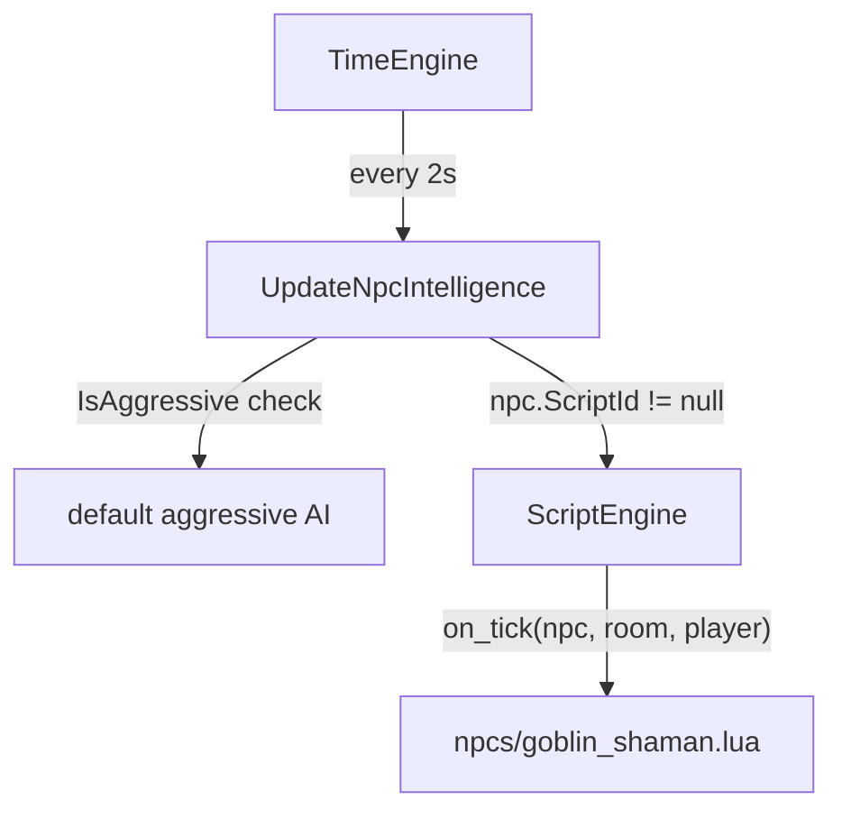

# Layer 3 — NPC Behaviour Scripts

## Prerequisite
Layer 1 (Foundation) must be complete. `ScriptEngine` is loaded and `RunFunction` is available.

## How it fits into the tick loop



The default aggressive logic runs first and is unchanged. Scripts fire as an additional step for NPCs that have a `ScriptId`.

## New files

### `ConsoleMud/Core/Scripting/LuaCharacterProxy.cs`

A shared `[MoonSharpUserData]` proxy for any `Character` (used here for both the NPC and the player argument, and reused in Layer 4 for room entry events). Exposes only safe read-only values.

```csharp
[MoonSharpUserData]
public class LuaCharacterProxy
{
    public string id           { get; }  // Character.Id.ToString()
    public string name         { get; }  // ColorMarkup.Strip(Character.Name)
    public int    health       { get; }
    public int    max_health   { get; }
    public double health_pct   { get; }  // health / max_health
    public int    level        { get; }
    public bool   is_player    { get; }  // character is Player
    public bool   is_in_combat { get; }  // CombatTarget != null
}
```

### `ConsoleMud/Core/Scripting/LuaRoomProxy.cs`

A `[MoonSharpUserData]` proxy for a `Room`. Exposes the fields a script needs to make decisions or pass to `game.teleport`.

```csharp
[MoonSharpUserData]
public class LuaRoomProxy
{
    public string id         { get; }  // Room.Id.ToString()
    public string virtual_id { get; }  // Room.VirtualId
    public string name       { get; }  // ColorMarkup.Strip(Room.Name)
    public bool   is_outside { get; }
    public bool   is_dark    { get; }
}
```

### `Scripts/npcs/example_shaman.lua`

Demonstrates the full NPC script contract.

```lua
skill_id is NOT used here — NPC scripts have no skill_id global.

function on_tick(npc, room, player)
    -- player is nil when no player is in the room
    if player == nil then return end

    -- at low health, print a message and flee
    if npc.health_pct < 0.25 then
        game.print("{MThe shaman screams and calls upon dark powers!{x")
        return
    end

    -- if not already fighting, engage
    if not npc.is_in_combat then
        game.engage(npc.id, player.id)
    end
end
```

## Modified files

### [`ConsoleMud/Entities/NpcBlueprint.cs`](ConsoleMud/ConsoleMud/Entities/NpcBlueprint.cs)

Add one nullable field:

```csharp
public string? ScriptId { get; set; }
```

Serialized from the area JSON as `"ScriptId": "npcs/example_shaman"`. Omitted (null) for NPCs that use only the default AI.

### [`ConsoleMud/Entities/NonPlayerCharacter.cs`](ConsoleMud/ConsoleMud/Entities/NonPlayerCharacter.cs)

Add the same field to the live entity:

```csharp
public string? ScriptId { get; set; }
```

### [`ConsoleMud/Core/Services/AreaLoaderService.cs`](ConsoleMud/ConsoleMud/Core/Services/AreaLoaderService.cs)

In `CreateLiveNpc`, copy the new field from blueprint to entity:

```csharp
ScriptId = bp.ScriptId
```

### [`ConsoleMud/Core/TimeEngine.cs`](ConsoleMud/ConsoleMud/Core/TimeEngine.cs)

After the existing aggressive-attack block in `UpdateNpcIntelligence`, add:

```csharp
// Scripted NPC behaviour — runs after the default aggressive check.
if (npc.ScriptId != null && ScriptEngine.HasScript(npc.ScriptId))
{
    var npcProxy    = new LuaCharacterProxy(npc);
    var roomProxy   = new LuaRoomProxy(room);
    var playerProxy = player != null ? new LuaCharacterProxy(player) : null;
    ScriptEngine.RunFunction(npc.ScriptId, "on_tick", npcProxy, roomProxy, playerProxy);
}
```

`player` here is already the `Player` found at the top of the room loop. Passing C# `null` to MoonSharp yields Lua `nil`, so the script's `if player == nil` guard works correctly.

The `using ConsoleMud.Core.Scripting;` import is added to `TimeEngine.cs`.

## NPC script authoring (area JSON)

To attach a script to an NPC in an area file, add `ScriptId` to the NPC template:

```json
{
  "VirtualId": "goblin_shaman",
  "Name": "goblin shaman",
  "ScriptId": "npcs/example_shaman",
  ...
}
```

The value must match the relative path of the `.lua` file under `Scripts/`, without the `.lua` extension.

## What does NOT change

- Default aggressive AI for all NPCs without a `ScriptId` — zero behaviour change.
- `CombatSystem`, `DeathService`, `PetSystem` — untouched.
- `LuaCharacterProxy` and `LuaRoomProxy` are also used by Layer 4, so creating them here avoids duplication.
