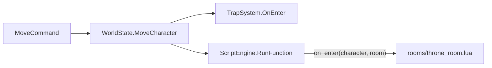

# Layer 4 — Room Event Scripts

## Prerequisites
- Layer 1 (Foundation): `ScriptEngine` is loaded and `RunFunction` is available.
- Layer 3 (NPC Behaviour): `LuaCharacterProxy` and `LuaRoomProxy` already exist and are reused here without modification.

## How it fits into the movement pipeline



The call to `ScriptEngine.RunFunction` is added immediately after the existing `TrapSystem.OnEnter` call inside `MoveCharacter`. The ordering — traps first, then scripts — means traps can kill an NPC before the room script fires.

## New file

### `Scripts/rooms/example_throne_room.lua`

Demonstrates the full room entry contract.

```lua
function on_enter(character, room)
    -- Fires for every character (player or NPC) entering the room.
    if not character.is_player then return end

    game.print("{YA cold wind sweeps through the throne room as you enter...{x")
end
```

Scripts under `rooms/` have no `skill_id` global — the script key is set in the area JSON via `ScriptId`, not auto-scanned like skills.

## Modified files

### [`ConsoleMud/Entities/RoomBlueprint.cs`](ConsoleMud/ConsoleMud/Entities/RoomBlueprint.cs)

Add one nullable field:

```csharp
// Optional: relative path to a Scripts/rooms/*.lua file (without extension).
// e.g. "rooms/throne_room". Null means no entry event.
public string? ScriptId { get; set; }
```

### [`ConsoleMud/Entities/Room.cs`](ConsoleMud/ConsoleMud/Entities/Room.cs)

Add the same field to the live entity:

```csharp
public string? ScriptId { get; set; }
```

### [`ConsoleMud/Core/Services/AreaLoaderService.cs`](ConsoleMud/ConsoleMud/Core/Services/AreaLoaderService.cs)

In Pass 1 (room creation), add `ScriptId = bp.ScriptId` to the `new Room { ... }` initializer:

```csharp
var liveRoom = new Room
{
    VirtualId   = bp.VirtualId,
    Name        = bp.Name,
    Description = bp.Description,
    IsOutside   = bp.IsOutside,
    IsDark      = bp.IsDark,
    ScriptId    = bp.ScriptId   // ← new
};
```

### [`ConsoleMud/Core/WorldState.cs`](ConsoleMud/ConsoleMud/Core/WorldState.cs)

Add `using ConsoleMud.Core.Scripting;` and, inside `MoveCharacter`, call the room script after `TrapSystem.OnEnter`:

```csharp
if (Rooms.TryGetValue(targetRoomId, out var newRoom))
{
    newRoom.Characters.Add(character);
    character.CurrentRoomId = targetRoomId;
    TrapSystem.OnEnter(character, newRoom, this);

    // Room entry script — fires after traps so dead NPCs don't receive the event.
    if (newRoom.ScriptId != null && ScriptEngine.HasScript(newRoom.ScriptId))
    {
        var charProxy = new LuaCharacterProxy(character);
        var roomProxy = new LuaRoomProxy(newRoom);
        ScriptEngine.RunFunction(newRoom.ScriptId, "on_enter", charProxy, roomProxy);
    }
}
```

## Room script authoring (area JSON)

Add `ScriptId` to the room blueprint in the area file:

```json
{
  "VirtualId": "throne_room",
  "Name": "The Throne Room",
  "ScriptId": "rooms/example_throne_room",
  ...
}
```

The value must match the relative path of the `.lua` file under `Scripts/`, without the `.lua` extension.

## What does NOT change

- `TrapSystem` — untouched and still fires first.
- All rooms without a `ScriptId` — zero behaviour change.
- `LuaCharacterProxy` and `LuaRoomProxy` — already exist from Layer 3, no modifications needed.
- `MoveCommand`, `FleeCommand`, `ShapeshiftHandler`, `PetSystem`, `DeathService` — all call `world.MoveCharacter` and will automatically benefit from the new hook.

---

# Layer 5 — Area Editor Web Tool (ScriptId fields)

## Scope

One file only: [`tools/area-editor.html`](tools/area-editor.html). No C# changes. No new scripts.

## What changes

The `SCHEMAS` object in the `<script>` block gains a `ScriptId` field descriptor in both the `npcs` and `rooms` sections. The field is a plain `text` input, included only when non-empty (`omitEmpty`), so existing area files that have no `ScriptId` are serialized identically.

### NPC schema — add after the `HasDarkvision` field (line ~715)

```js
{ name: "ScriptId", label: "Script Id (optional)", type: "text", include: "omitEmpty",
  placeholder: "npcs/my_script" },
```

### Room schema — add before the `Exits` field (line ~724)

```js
{ name: "ScriptId", label: "Script Id (optional)", type: "text", include: "omitEmpty",
  placeholder: "rooms/my_script" },
```

The `placeholder` text serves as inline documentation reminding the author of the expected path format.

## Serialization behaviour

`include: "omitEmpty"` is the existing mechanism used by other optional string fields. When the field is blank or absent, `shouldInclude` returns false and the key is omitted from the downloaded JSON — matching the nullable C# field.
