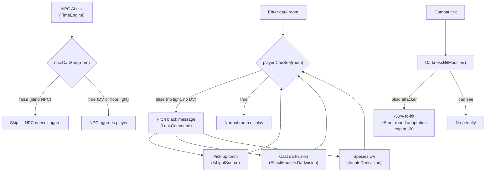

# Phase 2 — Light, Darkness & Darkvision: Finish Plan

## What's Already Done

The `534be2b Darkvision` commit landed the vast majority of the implementation. Everything below is already wired and working:

- **Data model**: `Room.IsDark`, `Item.IsLightSource/GrantsDarkvision`, `Character.InnateDarkvision`, `Character.DarknessAdaptation`, `Character.HasDarkvision` (computed), `Character.CanSee(room)`, `EffectModifier.Darkvision`
- **Blueprints + loader**: `RoomBlueprint.IsDark`, `ItemBlueprint.IsLightSource/GrantsDarkvision`, `NpcBlueprint.HasDarkvision` — all wired in [`AreaLoaderService.cs`](ConsoleMud/Core/Services/AreaLoaderService.cs)
- **Character creation**: `CharacterGenerator` sets `InnateDarkvision = species.HasDarkvision`; Elf/Dwarf/Orc have `HasDarkvision: true` in [`species.json`](ConsoleMud/Definitions/species.json)
- **Persistence**: `PlayerSave.InnateDarkvision` saved and loaded in [`SaveService.cs`](ConsoleMud/Core/Services/SaveService.cs)
- **Combat**: `CombatSystem.DarknessHitModifier()` — applies darkness penalty, increments adaptation per round, resets on fight end
- **Tuning**: `darkMissPenalty: 50`, `darkAdaptationPerRound: 5`, `darkAdaptationCap: 30` in [`tuning.json`](ConsoleMud/Definitions/tuning.json)
- **Look command**: room look and target look both gated on `CanSee` → "pitch black" message
- **Kill command**: gated on `CanSee` → "too dark to make out anything to attack"
- **Skill targeting**: `SkillContext.ResolveNpcTarget()` gated on `CanSee`
- **DarkvisionHandler**: spell registered, applies `EffectModifier.Darkvision` for `DurationTicks: 40`
- **Area builder**: prompts for `IsDark` on rooms, `IsLightSource`/`GrantsDarkvision` on items, `HasDarkvision` on NPCs
- **MoveCommand**: auto-runs `LookCommand` on arrival → "pitch black" message fires naturally when entering a dark room

## What's Missing — Three Gaps

### Gap 1 — NPC aggro ignores vision

[`TimeEngine.cs`](ConsoleMud/Core/TimeEngine.cs) line 81 in `UpdateNpcIntelligence()`:

```csharp
if (npc.IsAggressive && npc.Health > 0 && npc.CombatTarget == null)
{
    npc.CombatTarget = player;
    ...
}
```

An aggressive NPC that is blind in the dark still auto-attacks. The fix is adding one `CanSee` guard using `room` (already resolved above in the same loop):

```csharp
if (npc.IsAggressive && npc.Health > 0 && npc.CombatTarget == null && npc.CanSee(room))
```

`npc.CanSee(room)` checks: room is dark → NPC has darkvision? → floor items have a light source? This means a darkvision NPC still aggroes correctly, a blind NPC does not.

### Gap 2 — No dark content in the world to test against

Neither `emerald_forest.json` nor `fanatics_tower.json` has a dark room or light source item. Add the following to [`emerald_forest.json`](ConsoleMud/Areas/emerald_forest.json):

**New item templates:**
- `torch` — `IsLightSource: true`, getable, not equippable
- `goggles_of_night` — `GrantsDarkvision: true`, equippable (Head slot), not a light source

**New NPC template:**
- `cave_bat` — `HasDarkvision: true`, `IsAggressive: true`, level 2, 15 HP — tests that a darkvision NPC still aggroes in the dark

**New room:**
- `cave_entrance` — `IsDark: true`, `IsOutside: false`
- Name: "Cave Entrance", Description describes pitch black
- Exits: back to an existing forest room (e.g. `deep_woods` or `forest_entrance`)
- Spawns: 1 torch on the floor, 1 cave bat

This gives all verification paths:
- Enter room → "pitch black", can't look/kill
- Pick up torch → can see, can fight bat; bat attacks (it has darkvision)
- Without torch, elf/dwarf/orc player → can see and fight
- Cast `darkvision` → can see and fight

### Gap 3 — Docs and checklist still say "planned"

- [`docs/world-objects.md`](docs/world-objects.md): the "Phase 2 — planned" section needs to be replaced with documented behaviour (room dark flag, light source, darkvision sources, look/combat gates)
- [`BUILD_CHECKLIST.md`](BUILD_CHECKLIST.md): tick all five Phase 2 `[ ]` items to `[x]`

## Flow Diagram



## Deliverables

1. **[`TimeEngine.cs`](ConsoleMud/Core/TimeEngine.cs)** — add `npc.CanSee(room)` to aggro guard (1 line)
2. **[`emerald_forest.json`](ConsoleMud/Areas/emerald_forest.json)** — add torch item, goggles item, cave_bat NPC, cave_entrance room
3. **[`docs/world-objects.md`](docs/world-objects.md)** — document Phase 2 behaviour (replace "planned" stub)
4. **[`BUILD_CHECKLIST.md`](BUILD_CHECKLIST.md)** — tick all Phase 2 items, add "Phase 2 complete" line
