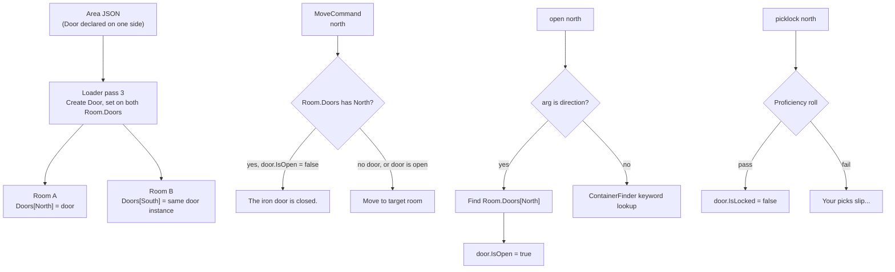

# Phase 3 — Doors

## Design Decisions

**Door as a shared object.** A door sits between two rooms. Rather than an ID-based lookup, the loader creates one `Door` instance and assigns it to *both* rooms' `Doors` dictionaries. State changes (open/close) are instantly visible from either side because they share the same reference. This is the simplest model for a single-process game.

**One-side declaration.** Area files only need to declare a door on one of the two connected rooms. The loader auto-populates the reciprocal side. Authoring is simpler; the builder follows the same convention.

**Direction-first command resolution.** `open north` resolves a door by direction first; `open chest` resolves a container by keyword as today. The same applies to `close`, `lock`, `unlock`. Order: try direction → fall through to container. If neither matches, report no target.

**Picklock.** With real doors, `PicklockHandler` graduates from its stub to a full implementation. It targets a locked door by direction or a locked container by keyword, rolls a standard proficiency check, and on success unlocks it (sets `IsLocked = false`).

---

## Data Flow



---

## New Files

### `Entities/Door.cs`
Runtime door state. Shared by reference between both rooms.

```csharp
public class Door
{
    public string Name { get; set; } = "door";
    public string Description { get; set; } = "";
    public bool IsOpen { get; set; } = true;
    public bool IsLocked { get; set; }
    public string? LockKeyId { get; set; }
}
```

### `Entities/DoorBlueprint.cs`
Area file schema. Only needs to appear on one side of the exit.

```csharp
public class DoorBlueprint
{
    public string Name { get; set; } = "door";
    public string Description { get; set; } = "";
    public bool StartsLocked { get; set; }
    public string? LockKeyId { get; set; }
}
```

---

## Modified Files

### [`Entities/Room.cs`](ConsoleMud/Entities/Room.cs)
Add `Doors` alongside `Exits`. Exits still drives movement target lookup; Doors drives state.

```csharp
public Dictionary<Direction, Door> Doors { get; set; } = new();
```

### [`Entities/RoomBlueprint.cs`](ConsoleMud/Entities/RoomBlueprint.cs)
Add optional `Doors` map. The key is the direction string matching an entry in `Exits`.

```csharp
public Dictionary<string, DoorBlueprint> Doors { get; set; } = new();
```

### [`Core/Services/AreaLoaderService.cs`](ConsoleMud/Core/Services/AreaLoaderService.cs)
Add a **third pass** after exits are wired. For each room+direction that has a `DoorBlueprint`, check whether the target room already has a door on the reciprocal direction (set from the other side). If yes, reuse that object; if no, create a new `Door`, assign it to the current room, and immediately also assign it to the target room's reciprocal direction.

This guarantees exactly one `Door` object per physical doorway regardless of which room the blueprint came from.

### [`Core/Commands/ContainerCommands.cs`](ConsoleMud/Core/Commands/ContainerCommands.cs)
Extend `ContainerFinder` with a parallel `FindDoor(player, world, args)` helper that parses the first arg as a direction name. Extend each command (`Open`, `Close`, `Lock`, `Unlock`) to call `FindDoor` first; only fall through to container keyword lookup if no door matched.

Error messages for doors mirror those for containers:
- `open north` when door is already open → "The iron door is already open."
- `lock north` when no key → "You don't have the key to lock the iron door."

### [`Core/Commands/MoveCommand.cs`](ConsoleMud/Core/Commands/MoveCommand.cs)
After confirming the exit exists, add one check before moving:

```csharp
if (currentRoom.Doors.TryGetValue(_direction, out var door) && !door.IsOpen)
{
    Console.WriteLine($"The {door.Name} is closed.");
    return;
}
```

### [`Core/Commands/LookCommand.cs`](ConsoleMud/Core/Commands/LookCommand.cs)
Enrich the exits line to show door state where present:

```
Exits: north (iron door, locked), south, east
```

Each exit is formatted as `direction` or `direction (door name, state)` where state is "open", "closed", or "locked".

### [`Core/Skills/Handlers/Thief/StubSkills.cs`](ConsoleMud/Core/Skills/Handlers/Thief/StubSkills.cs) → `PicklockHandler.cs`
Graduate `PicklockHandler` from stub to implementation. Target resolution:
- If arg is a direction name → find door in `Room.Doors[direction]`
- Otherwise → find locked container by keyword in room or inventory
- Gate: must be locked (`IsLocked = true`)
- Roll: `ProficiencyMath.RollSuccess(proficiency)`
- On pass: `target.IsLocked = false`; message "Click. You pick the lock on the iron door."
- On fail: "Your picks slip against the lock." (proficiency still ticks up)

Move `PicklockHandler` to its own file `Handlers/Thief/PicklockHandler.cs` and delete its class from `StubSkills.cs`.

### [`Helpers/AreaBuilder.cs`](ConsoleMud/Helpers/AreaBuilder.cs)
In `LinkExits`, after the user picks a direction and target room for an exit, ask:

```
Does this exit have a door? (y/n) [n]
```

If yes, prompt for name (default "door"), starts locked (y/n), and lock key id if locked. Write a `DoorBlueprint` into `room.Doors[dir]`. The reciprocal exit does not need a door entry because the loader auto-syncs.

Update `Validate` to check that every entry in `room.Doors` has a matching direction in `room.Exits`.

---

## Area Content — Test Door

Add a locked iron door on the `cave_entrance` south exit back to `deep_woods`. This creates a door the player must unlock (or picklock) to leave the cave:

- Door: "iron door", `StartsLocked: false` (start open for easy entry; lock it from inside to test).

Actually a more interesting test: add a second path — a **crypt** room off `forest_entrance`, behind a locked wooden door requiring a `crypt_key` item spawned elsewhere in the forest. This tests:
- Movement blocked by closed door
- `unlock north` with key → open → move through
- `picklock north` (thief) → unlock without key
- `lock north` from inside → leave crypt locked again

Add to [`emerald_forest.json`](ConsoleMud/Areas/emerald_forest.json):
- Item template: `crypt_key` (KeyId: "crypt_key")
- NPC template: `skeleton_guard` (undead, aggressive, level 3)
- Room: `ancient_crypt` (dark, not outside), exit South to `forest_entrance`, door `wooden door` (StartsLocked: true, LockKeyId: "crypt_key")
- Spawn the crypt_key in `forest_entrance` (or in `deep_woods`)
- Spawn 1–2 skeleton guards in the crypt
- Add North exit from `forest_entrance` to `ancient_crypt` with door

---

## Docs & Checklist

- [`docs/world-objects.md`](docs/world-objects.md): Add Phase 3 section (Door entity, schema, commands, picklock)
- [`BUILD_CHECKLIST.md`](BUILD_CHECKLIST.md): Tick Phase 3 items

---

## Summary of Deliverables

- `Entities/Door.cs` — new
- `Entities/DoorBlueprint.cs` — new
- `Entities/Room.cs` — add `Doors` dict
- `Entities/RoomBlueprint.cs` — add `Doors` dict
- `Core/Services/AreaLoaderService.cs` — third load pass for doors + auto-sync
- `Core/Commands/ContainerCommands.cs` — direction-first door resolution in all 4 commands
- `Core/Commands/MoveCommand.cs` — gate on closed door
- `Core/Commands/LookCommand.cs` — exits show door state
- `Core/Skills/Handlers/Thief/PicklockHandler.cs` — new real implementation
- `Core/Skills/Handlers/Thief/StubSkills.cs` — remove `PicklockHandler` class
- `Helpers/AreaBuilder.cs` — door prompts in `LinkExits` + validation
- `Areas/emerald_forest.json` — crypt_key item, skeleton_guard NPC, ancient_crypt room with wooden door
- `docs/world-objects.md` — Phase 3 documented
- `BUILD_CHECKLIST.md` — Phase 3 ticked
