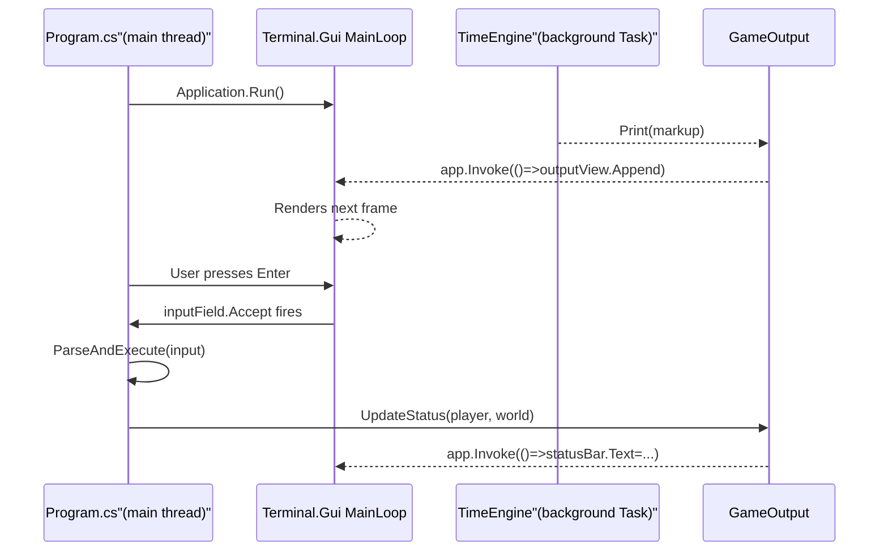

# Terminal.Gui TUI Integration

## Layout (bottom to top)

```
┌─────────────────────────────────────┐
│                                     │ ← GameOutputView (scrollable, colored)
│   Game output fills this space      │   Height = Dim.Fill(2)
│                                     │
├─────────────────────────────────────┤
│ [HP: 45/80] [Mana: 30/60] [Forest] │ ← StatusBar Label   Y = Pos.AnchorEnd(2)
├─────────────────────────────────────┤
│ > _                                 │ ← InputField        Y = Pos.AnchorEnd(1)
└─────────────────────────────────────┘
```

## Package

Add to `ConsoleMud/ConsoleMud.csproj`:
```xml
<PackageReference Include="Terminal.Gui" Version="2.*" />
```

## New files

### `ConsoleMud/Helpers/GameOutput.cs`

Static bridge between game code and the TUI. Has two modes — during boot (plain console fallback) and TUI-active (marshalled updates via `App.Invoke`):

```csharp
public static class GameOutput
{
    private static GameOutputView? _outputView;
    private static Label?          _statusBar;
    private static IApplication?   _app;

    public static void Setup(GameOutputView view, Label statusBar, IApplication app)
    {
        _outputView = view; _statusBar = statusBar; _app = app;
    }

    public static void Print(string markup, ConsoleColor baseColor = ConsoleColor.Gray)
    {
        var segments = ColorMarkup.ParseSegments(markup, baseColor);
        _app?.Invoke(() => _outputView?.Append(segments));
    }

    public static void UpdateStatus(Player player, WorldState world)
    {
        var text = $"[HP: {player.Health}/{player.MaxHealth}] "
                 + $"[Mana: {player.Mana}/{player.MaxMana}] "
                 + $"[{world.Rooms[player.CurrentRoomId].Name}]";
        _app?.Invoke(() => { if (_statusBar != null) _statusBar.Text = text; });
    }
}
```

### `ConsoleMud/Views/GameOutputView.cs`

A custom `View` subclass that stores a `List<ColoredLine>` (each line is a list of `(string text, ConsoleColor color)` segments), renders them using Terminal.Gui's `SetAttribute()` + `Move()` + `AddStr()`, and auto-scrolls to the last line on `Append`. Handles window resize automatically because `OnDrawContent` re-reads viewport bounds each frame.

## Modified files

### `ConsoleMud/Helpers/ColorMarkup.cs`

Add a new method alongside the existing `Render()`:

```csharp
/// <summary>Parses markup into segments for TUI rendering (no Console calls).</summary>
public static IReadOnlyList<(string Text, ConsoleColor Color)> ParseSegments(
    string text, ConsoleColor baseColor) { ... }
```

This is the data-producing equivalent of `Render()`.

### `ConsoleMud/Helpers/ColorConsole.cs`

Route every call through `GameOutput.Print()` instead of directly writing to the console:

```csharp
public static void WriteLine(string text, ConsoleColor? baseColor = null)
    => GameOutput.Print(text + "\n", baseColor ?? Console.ForegroundColor);
```

### `ConsoleMud/Core/TimeEngine.cs`

Remove the three `Console.Write("> ")` calls at lines 90, 121, and 146. The sticky input field replaces the need for a re-printed prompt.

### `ConsoleMud/Program.cs`

Replace the raw `while(true)` loop with a Terminal.Gui session. Key structure:

```csharp
// --- PRE-TUI: character creation stays on plain console ---
var player = SelectCharacter(...);         // existing code, untouched
world.Characters[player.Id] = player;
// ...

// --- TUI SESSION ---
var app = Application.Init();

var outputView = new GameOutputView { ... };
var statusBar  = new Label { Y = Pos.AnchorEnd(2), ... };
var inputField = new TextField { Y = Pos.AnchorEnd(1), ... };

GameOutput.Setup(outputView, statusBar, app);

// Wire command history (UP/DOWN on inputField)
var history = new List<string>();
int histIdx  = -1;
inputField.KeyDown += (s, e) => {
    if (e.KeyCode == KeyCode.CursorUp && history.Count > 0) {
        histIdx = Math.Min(histIdx + 1, history.Count - 1);
        inputField.Text = history[histIdx]; e.Handled = true;
    } else if (e.KeyCode == KeyCode.CursorDown) {
        histIdx = Math.Max(histIdx - 1, -1);
        inputField.Text = histIdx < 0 ? "" : history[histIdx]; e.Handled = true;
    }
};

// Wire Enter to execute commands
inputField.Accept += (s, e) => {
    var input = inputField.Text?.ToString() ?? "";
    inputField.Text = "";
    histIdx = -1;
    if (!string.IsNullOrWhiteSpace(input)) history.Insert(0, input);
    if (input is "quit" or "exit") { SaveService.Save(player, world); app.RequestStop(); return; }
    parser.ParseAndExecute(input, player, world);
    GameOutput.UpdateStatus(player, world);
};

// TimeEngine starts now (safe: all its output goes via GameOutput → Invoke)
Task.Run(() => timeEngine.StartAsync(cts.Token));

// Print initial look
new LookCommand().Execute(player, Array.Empty<string>(), world);
GameOutput.UpdateStatus(player, world);

Application.Run(top);
Application.Shutdown();
```

## Thread safety

The `TimeEngine` runs on a `Task.Run` background thread. Every call that touches UI — `GameOutput.Print()`, `GameOutput.UpdateStatus()` — wraps its body in `_app.Invoke(() => { ... })`, which queues the action on the Terminal.Gui main thread. No locks needed.

## Sequence diagram


