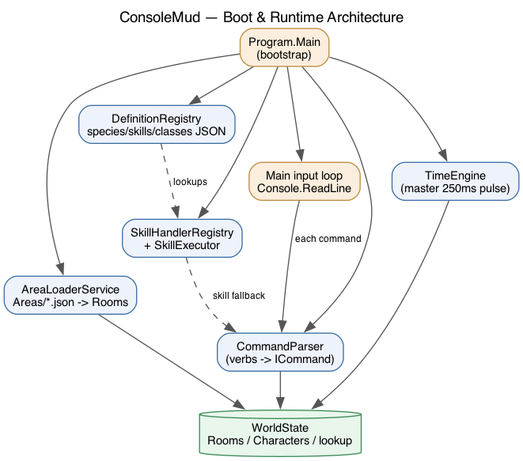

# ConsoleMud — Developer Guide

This guide explains how the engine is wired and how to extend it. It pairs prose
with diagrams (PNGs in [`diagrams/`](diagrams/), regenerated by
[`diagrams/generate_diagrams.py`](diagrams/generate_diagrams.py)).

## Architecture at a glance



`Program.Main` boots five things and then runs a console input loop:

| Component | File | Role |
|---|---|---|
| `DefinitionRegistry` | `Core/Services/DefinitionRegistry.cs` | Loads `Definitions/*.json` (species, skills, classes) into memory |
| `AreaLoaderService` | `Core/Services/AreaLoaderService.cs` | Turns `Areas/*.json` into live `Room`/`Item`/NPC instances inside `WorldState` |
| `WorldState` | `Core/WorldState.cs` | The single source of truth: rooms, characters, VirtualId lookup, safe room |
| `CommandParser` | `Core/CommandParser.cs` | Maps typed verbs to `ICommand`s; unknown verbs fall through to the skill system |
| `TimeEngine` | `Core/TimeEngine.cs` | The heartbeat: one master pulse drives every timed subsystem |
| `SkillExecutor` + registries | `Core/Skills/*` | Runs active skills; `PassiveService` applies passives |

## The layers

- **Entities** (`Entities/`) — plain data: `Character`, `Player`, `NonPlayerCharacter`, `Item`, `Room`, `StatusEffect`, the `Definitions/*` blueprints, and the `PlayerSave` DTO.
- **Enums** (`Enums/`) — `Species`, `CharacterClass`, `DamageType`, `EffectModifier`, `EquipmentSlot`, `Form`, `Position`, `Archetype`, etc.
- **Core** (`Core/`) — the running systems: combat, time, skills, services, commands.
- **Helpers** (`Helpers/`) — creation flow, keyword parsing, colour rendering.
- **Data** — `Definitions/*.json` (rules) and `Areas/*.json` (world content).

## How to extend (start here)

| I want to add a... | Read |
|---|---|
| Skill | [skills.md](skills.md) |
| Class | [classes.md](classes.md) |
| Species | [species.md](species.md) |
| Timed behaviour | [tick-system.md](tick-system.md) |
| Combat mechanic / buff / debuff | [combat.md](combat.md) |
| Command / verb | [commands.md](commands.md) |
| Coloured name/description | [colour.md](colour.md) |

Other references: [persistence.md](persistence.md), [leveling.md](leveling.md) (XP + character creation), [tuning.md](tuning.md) (engine balance constants), [area-builder.md](area-builder.md) (interactive area creation).

## Core conventions

- **Logic strips, display renders.** Names/descriptions may contain colour codes (e.g. `{Rdire wolf{x`). All matching/saving uses `ColorMarkup.Strip`; all on-screen output goes through `ColorConsole`.
- **Rooms link by `Guid` at runtime but by `VirtualId` in data.** Runtime GUIDs change every boot, so anything persisted (saves) stores `VirtualId` and resolves it on load.
- **Definitions are data; effects are code.** A skill/class/species *exists* because of JSON; its *behaviour* lives in a handler or service keyed by id. JSON entries with no code yet are inert and say so.
- **Tuning lives in data, not constants.** Engine-wide balance numbers are in `Definitions/tuning.json` (read via `TuningRegistry`); per-skill numbers are in each skill's `Parameters`. See [tuning.md](tuning.md). Don't hardcode balance values in handlers.
- **One clock.** Never spin a private timer. Add a subsystem to the `TimeEngine` master pulse (see [tick-system.md](tick-system.md)).

## Regenerating the diagrams

```bash
python3 docs/diagrams/generate_diagrams.py   # needs: graphviz (dot) + py-graphviz
```
