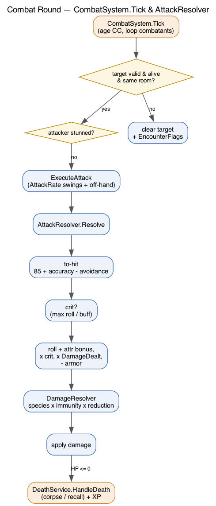
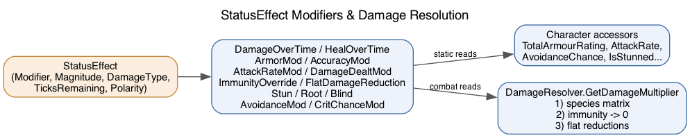

# Combat, Status Effects & Damage Resolution

## The combat round

`CombatSystem.Tick` (`Core/CombatSystem.cs`) runs once per combat pulse (1 s). It
ages crowd-control effects, then for every character with a `CombatTarget` it
validates the target, skips stunned attackers, and resolves an attack.



`ExecuteAttack` swings the main hand `AttackRate` times (haste/slow change the
count) plus one off-hand swing when dual-wielding. Every hit — auto-attack or
skill — flows through one pipeline.

## AttackResolver

`Core/Combat/AttackResolver.cs` is the single attack pipeline:

1. **To-hit:** `85 + attacker.AccuracyBonus - defender.AvoidanceChance` vs d100.
2. **Roll + attribute bonus:** dice plus `(attr-10)/2` if an `AttributeBonus` is given.
3. **Crit:** a natural max roll (when the attacker qualifies, e.g. `critical_mastery`) or a buff-driven `CritChanceBonus`; doubles damage.
4. **Outgoing buffs:** `× DamageDealtMultiplier` (e.g. berserk +50%).
5. **Armor:** physical damage is reduced by `TotalArmourRating` unless `ignoresArmor`.
6. **Type multiplier:** `DamageResolver.GetDamageMultiplier` (below).

```csharp
var outcome = AttackResolver.Resolve(attacker, defender, dice, DamageType.Physical,
                                     attributeBonus: "Strength", critOnMaxRoll: hasCritMastery);
if (outcome.Hit) { defender.Health -= outcome.Damage; ... }
```

## StatusEffect — the modifier framework

`Entities/StatusEffect.cs` is one timed modifier. The `EffectModifier` it carries
decides what it does:



| Modifier | Effect |
|---|---|
| `DamageOverTime` / `HealOverTime` | HP change per status tick |
| `ArmorMod` | adds to `TotalArmourRating` |
| `AccuracyMod` / `AvoidanceMod` | to-hit / dodge |
| `AttackRateMod` | extra/fewer swings per round |
| `DamageDealtMod` | % change to outgoing damage |
| `ImmunityOverride` | immune to a `DamageType` while active |
| `FlatDamageReduction` | % cut to a `DamageType` |
| `CritChanceMod` | added crit % |
| `Stun` / `Root` / `Blind` | lose turn / can't move / can't cast |

`Character` exposes computed accessors that fold active effects:
`TotalArmourRating`, `AttackRate`, `AccuracyBonus`, `AvoidanceChance`,
`DamageDealtMultiplier`, `IsStunned`, `IsRooted`, `IsBlinded`.

Polarity (`Positive`/`Negative`) and `EffectType` (Poison, Curse, Magic, Mental...)
support cleanse/dispel: remove negatives by type without stripping the target's buffs.

## DamageResolver

`Core/Combat/DamageResolver.cs` layers three things, in order:

1. **Species matrix** — `Character.DamageMultipliers[type]` (0 immune, 0.5 resist, 2 vulnerable, default 1). Populated from `species.json` at creation.
2. **Immunity overrides** — any active `ImmunityOverride` for the type returns 0.
3. **Flat reductions** — each `FlatDamageReduction` multiplies by `(1 - pct/100)`.

Immunity yields 0 damage; otherwise the result floors at 1.

## Death

`Core/Combat/DeathService.HandleDeath(dead, world, killer)`:
- **Player:** clears effects, recalls to `WorldState.SafeRoomId` at 1 HP (no `Environment.Exit`).
- **NPC:** removes it, spawns a corpse container holding its gear + inventory, breaks others' targeting, and awards `XpReward` to a player killer via `LevelingService`.

Call it from any handler that can reduce a target to 0, passing `ctx.Caster` as the killer so XP is attributed.

## Adding a buff/debuff

Add a `StatusEffect` to the target with the right `EffectModifier`, `Magnitude`,
`DamageType`, and `TicksRemaining`. CC (`Stun`/`Root`/`Blind`) ages on the combat
pulse; everything else on the status pulse. No other wiring needed — the accessors
and resolver pick it up automatically.
