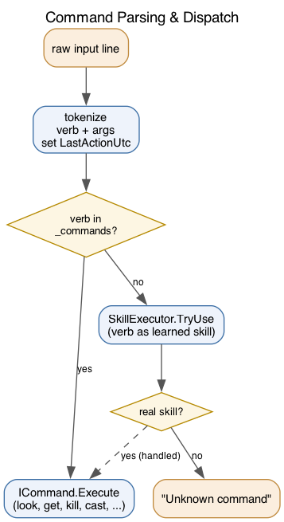

# Commands

Player input is handled by `CommandParser` (`Core/CommandParser.cs`). It tokenizes
the line into a verb plus args, records activity for the stealth timer, then
dispatches.



- If the verb is a registered built-in, its `ICommand.Execute(player, args, world)` runs.
- Otherwise the verb is tried as a learned skill via `SkillExecutor.TryUse` (so `kick rat` works without a dedicated command).
- If neither matches, "Unknown command".

## The `ICommand` contract

`Core/Commands/ICommand.cs`:

```csharp
public interface ICommand
{
    void Execute(Player player, string[] args, WorldState world);
    string Description => "No description available.";   // shown by `help`
    string Usage => "";
    string Example => "";
}
```

The metadata members power `help <command>` and the `commands` list. `commands`
hides short-form aliases by comparing a key's length to its canonical `Usage`
token, so `attack`/`take` stay visible while `k`/`l`/`n` are hidden.

## Adding a command

1. Create a class implementing `ICommand` in `Core/Commands/`, with `Description`/`Usage`/`Example`.
2. Register it in the `CommandParser` constructor: `_commands["myverb"] = new MyCommand();` (add aliases as extra keys).
3. If it needs a service (registry, executor), pass it through the parser constructor like `CastCommand`/`SkillsCommand` do.

## Useful existing commands

| Verb(s) | Command | Notes |
|---|---|---|
| `look`, `l` | `LookCommand` | room, item, or inside a container |
| `get`/`take`, `drop`, `put`, `inventory` | item handling | keyword + `2.dagger` index matching |
| `wield`, `second`, `wear`, `equipment` | gear | main hand / off hand / armour |
| `kill`/`attack`, `flee`, `cast` | combat | `cast <spell> [target]` |
| `sit`, `rest`, `stand` | posture | drives regen rate |
| `status`, `skills`, `save` | info / persistence | level, XP, proficiency |
| `specialize <element>` | Mage only | sets fire/cold/lightning for `elemental_mastery` |
| `shapeshift <form>`, `breath` | Druid forms | bear/wolf/owl/dragon/human; `breath` in dragon form |
| `weather` | environment | current sky when outdoors |
| `help`, `commands` | discovery | self-describing |
