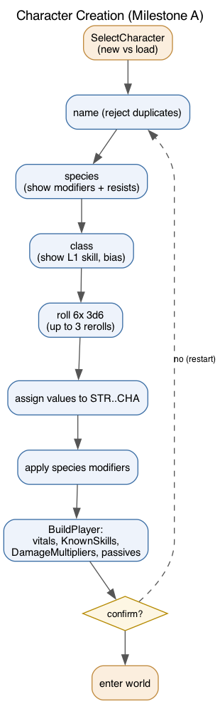

# Leveling, XP & Character Creation

## Character creation (Milestone A)

`CharacterGenerator.CreateNewPlayer` orchestrates the stepped flow in
`Helpers/CreationSteps.cs`:



1. **Name** — blank becomes "Hero"; names with an existing save are rejected.
2. **Species** — lists modifiers + resistances from `species.json`.
3. **Class** — lists HP/mana bias and the level-1 skill from `classes.json`.
4. **Roll** — six 3d6 values, up to 3 rerolls of the whole set.
5. **Assign** — place each rolled value into STR/DEX/CON/INT/WIS/CHA.
6. **Apply species modifiers**, then **confirm** (or restart).

`BuildPlayer` then sets vitals, parses species/class ids to enums, fills
`DamageMultipliers`, seeds `KnownSkills` with the level-1 skills, and calls
`PassiveService.Refresh`.

## XP and leveling

`Core/Services/LevelingService.cs`. Levels run 1 to `MaxLevel` (101 — the HERO tier).

- **XP to advance:** `XpForNextLevel(level) = 100 * level`.
- **On kill:** `DeathService.HandleDeath(..., killer)` awards the NPC's `XpReward`
  (from `NpcBlueprint`, or a fallback `level*10 + maxHealth`) to a player killer.
- **`AwardXp`** adds XP and loops `LevelUp` while the threshold is met (one award can span several levels).

### What a level-up does

```csharp
player.Level++;
player.MaxHealth += HpPerLevel + (CON-10)/2;   // class growth + attribute modifier
player.MaxMana   += ManaPerLevel + (INT-10)/2;
player.Health = player.MaxHealth;              // full restore
player.Mana   = player.MaxMana;
LearnNewSkills(player);                         // every class skill with Level <= new level
PassiveService.Refresh(player);                 // (re)apply static passives
```

Newly unlocked skills are learned at their `StartingProficiency` and announced;
the `skills` command then shows them. `StatusCommand` shows `Level` and `XP / next`.

## Tuning

- XP curve: `XpForNextLevel`.
- Per-class growth: `HpPerLevel` / `ManaPerLevel` in `classes.json`.
- NPC rewards: `XpReward` (or the fallback formula) in the area file / loader.

## Known gaps

- DoT/environment kills do not yet attribute a killer, so they award no XP.
- The Mage specialization prompt (Fire/Cold/Lightning) is not yet hooked to a level.
