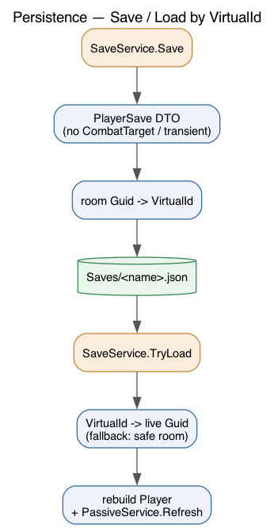

# Persistence (Save / Load)

Characters save to plain JSON, one file per character under `Saves/`.

## The VirtualId problem

Rooms get a fresh `Guid` every boot, so a saved room `Guid` is meaningless after a
restart. The fix:

- `Room.VirtualId` is the stable id from the area file and is kept on the live room.
- `WorldState.RoomsByVirtualId` maps `VirtualId -> Guid`, populated during area load.
- Saves store the player's room as a `VirtualId`; load resolves it back to a live `Guid` (falling back to `WorldState.SafeRoomId`, then any room).

## What gets saved

`SaveService.Save` (`Core/Services/SaveService.cs`) builds a flat `PlayerSave` DTO
(`Entities/PlayerSave.cs`): identity, species/class, level/experience, the six
attributes, vitals, `Specialization`, `KnownSkills`, `DamageMultipliers`,
inventory, equipment, and the location VirtualId.

**Deliberately not saved:** `CombatTarget` (a live reference), cooldowns, and
status effects. Static passive effects are rebuilt on load by
`PassiveService.Refresh`, so they are not persisted either.

## When it saves

- `save` command (`Core/Commands/SaveCommand.cs`).
- On `quit` (`Program.cs`).
- Timed autosave every `AutosaveInterval` (480 pulses / 120 s) in `TimeEngine`.

## Startup: create or load

`Program.SelectCharacter` offers load-or-new. Loading reads the save and resolves
the room; creating a name that already has a save is blocked and re-prompted
(`CreationSteps.PromptName` checks `SaveService.Exists`).

## Death

Not a save concern: dying recalls the player to `WorldState.SafeRoomId` at 1 HP
and clears effects (`DeathService`). There is no separate death file or permadeath.

## Filenames

`Saves/<sanitized-name>.json` — the name is lowercased and stripped to
alphanumerics. Format is human-readable JSON (tamper-resistance is deferred).
Consider adding `Saves/` to `.gitignore`.
