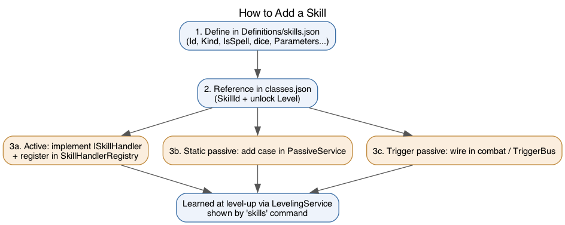
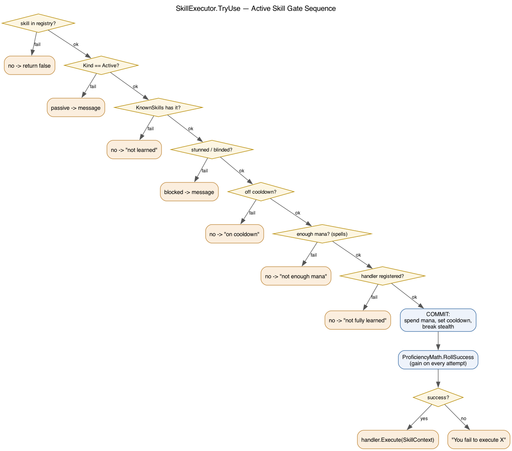

# Skills: How They Work & How to Add One

A skill has two halves: a **definition** (data, in `Definitions/skills.json`) and,
for anything with an effect, a piece of **code** keyed by the skill's `Id`.
Classes reference skills by id and unlock level in `Definitions/classes.json`.



## The definition (`SkillDefinition`)

`Entities/Definitions/SkillDefinition.cs`. Authored in `Definitions/skills.json`:

```json
{
  "Id": "magic_missile",
  "Name": "magic missile",
  "Description": "Bolts of pure arcane force that ignore armor and shields.",
  "Kind": "Active",          // "Active" | "Passive"
  "IsSpell": true,            // only spells cost mana
  "ManaCost": 5,
  "CooldownSeconds": 0,
  "DurationTicks": 0,         // for buffs/debuffs that linger
  "DamageType": "Force",
  "DiceNotation": "1d4",
  "AttributeBonus": "Wisdom", // optional: adds (attr-10)/2 to the roll
  "StartingProficiency": 1.0,
  "Tags": ["Active", "Spell"],
  "Parameters": { "ignoresArmor": 1 }   // free-form numeric tunables
}
```

The **`Parameters` bag** is the key to keeping numbers out of code: multipliers,
chances, thresholds, charges, durations-in-rounds all live here and are read by
the handler via `ctx.Param("key", fallback)`. Tune balance without recompiling.

## Proficiency

`Player.KnownSkills` is `skillId -> proficiency (1..100)`. Rules in
`Core/Skills/ProficiencyMath.cs`:

- **Success:** `RollSuccess` — even at 100 there is a ~0.001% miss (ceiling 99.999).
- **Gain:** rises on *every attempt* (success or fail), fast early and crawling near 100.

The `skills` command (`Core/Commands/SkillsCommand.cs`) shows the class table with
unlock levels and the player's live proficiency.

## Active skills — the executor

`SkillExecutor.TryUse` (`Core/Skills/SkillExecutor.cs`) runs the gate sequence
before any handler fires:



Players reach it two ways, both ending in `TryUse`:
- `cast <spell> [target]` via `CastCommand`.
- A bare skill verb (`kick rat`) that isn't a built-in command — the parser falls through to `TryUse`.

## Writing an active handler

Implement `ISkillHandler` (`Core/Skills/ISkillHandler.cs`). The executor has
already checked knowledge, cooldown, mana, and the proficiency roll, so the
handler only does the effect. It receives a `SkillContext`:

| Member | Use |
|---|---|
| `ctx.Caster` | who cast it |
| `ctx.World` | rooms/characters |
| `ctx.Definition` | the `SkillDefinition` (dice, etc.) |
| `ctx.Param(key, fallback)` | a tunable from `Parameters` |
| `ctx.ResolveNpcTarget()` | named NPC in room, else current combat target |
| `ctx.ResolveFriendlyTarget()` | named ally, else self (heals/buffs) |
| `ctx.Engage(target)` | start combat + break stealth |
| `ctx.AttributeModifier("Wisdom")` | tabletop modifier |

Example (`Core/Skills/Handlers/Druid/EntangleHandler.cs`):

```csharp
public class EntangleHandler : ISkillHandler
{
    public string SkillId => "entangle";

    public void Execute(SkillContext ctx)
    {
        var target = ctx.ResolveNpcTarget();
        if (target == null) { Console.WriteLine("Entangle what?"); return; }

        ctx.Engage(target);
        int rounds = Math.Max(1, (int)ctx.Param("rootRounds", 2));
        target.StatusEffects.Add(new StatusEffect {
            Name = "entangling roots", Modifier = EffectModifier.Root,
            Type = EffectType.Magic, DamageType = DamageType.Nature,
            Polarity = EffectPolarity.Negative, TicksRemaining = rounds
        });
        Helpers.ColorConsole.WriteLine($"Roots bind {target.Name}!", ConsoleColor.Gray);
    }
}
```

Damage skills use `AttackResolver.Resolve(...)` and `DeathService.HandleDeath(target, ctx.World, ctx.Caster)` on a kill (the killer arg awards XP). See [combat.md](combat.md).

Register it in `Core/Skills/SkillHandlerRegistry.cs`:

```csharp
Register(new EntangleHandler());
```

## Passive skills

Passives are **not** used actively — the executor reports "works on its own". They
come in three flavours:

1. **Static bonus** (e.g. `armor_optimization`, `parry`, `indomitable_will`): add a
   `case` in `PassiveService.ApplyStaticPassive` (`Core/Skills/PassiveService.cs`).
   It emits a permanent, tagged `StatusEffect`. `PassiveService.Refresh` is called
   on creation, level-up, and load, so attribute-scaled passives stay current.

   ```csharp
   case "armor_optimization":
       Add(c, skillId, EffectModifier.ArmorMod, Param(skillId, "armorBonus", 2));
       break;
   ```

2. **Combat-wired** (e.g. `critical_mastery`, `second_wind`): checked directly in
   `CombatSystem` by `KnownSkills.ContainsKey(...)`.

3. **Event-triggered** (e.g. `retribution_aura`, `holy_fervor`): implement
   `IPassiveHandler` with a `SkillTrigger`, register it in
   `PassiveService.Initialize`, and the bus fires it for owners who know the skill.
   `OnIncomingHit` and `OnOutgoingHit` are wired into `CombatSystem` today (see
   [combat.md](combat.md)); the other triggers (`OnCast`, `OnLook`, `OnMaxRoll`,
   `OnLowHealth`, `OnIncomingSpell`) exist on the bus but need their fire points
   added at the relevant site.

   ```csharp
   public class RetributionAuraPassive : IPassiveHandler
   {
       public string SkillId => "retribution_aura";
       public SkillTrigger Trigger => SkillTrigger.OnIncomingHit;
       public void OnTrigger(TriggerContext ctx) { /* sear ctx.Other */ }
   }
   ```

## Checklist to add a skill

1. Add the entry to `Definitions/skills.json`.
2. Reference it in the class's `Skills` list in `Definitions/classes.json` (id + unlock level).
3. Implement the behaviour:
   - active -> `ISkillHandler` + register in `SkillHandlerRegistry`;
   - static passive -> a `case` in `PassiveService`;
   - trigger passive -> wire into combat / `TriggerBus`.
4. A character learns it automatically at the unlock level via `LevelingService`, and it appears in the `skills` command.
