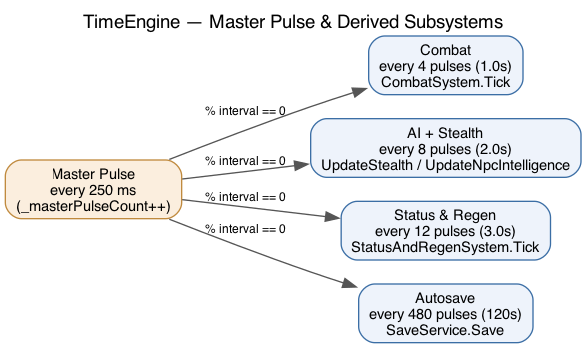

# The Universal Tick System

Everything time-based runs off one clock. `TimeEngine` (`Core/TimeEngine.cs`)
increments a master pulse every 250 ms and fires each subsystem when the pulse
count is divisible by that subsystem's interval. This keeps the world
deterministic and synchronized — no drifting per-entity timers.



## The master pulse

```csharp
while (!token.IsCancellationRequested)
{
    _masterPulseCount++;
    if (_masterPulseCount % CombatInterval == 0)  _combatSystem.Tick();
    if (_masterPulseCount % StatusInterval == 0)  _statusAndRegenSystem.Tick();
    if (_masterPulseCount % AiInterval == 0)     { UpdateStealth(); UpdateNpcIntelligence(); }
    if (_masterPulseCount % AutosaveInterval == 0) /* save each player */;
    await Task.Delay(UniversalTickTimeBase, token);
}
```

## Intervals (all multiples of the 250 ms base)

| Constant | Pulses | Real time | Drives |
|---|---|---|---|
| `CombatInterval` | 4 | 1.0 s | `CombatSystem.Tick` — auto-attacks, CC ageing, second-wind |
| `AiInterval` | 8 | 2.0 s | `UpdateStealth` (idle auto-hide) + `UpdateNpcIntelligence` (aggro) |
| `StatusInterval` | 12 | 3.0 s | `StatusAndRegenSystem.Tick` — DoT/HoT, regen, effect expiry |
| `WeatherInterval` | 240 | 60 s | `UpdateWeather` — rolls `WorldState.CurrentWeather`, announced to players outside |
| `AutosaveInterval` | 480 | 120 s | `SaveService.Save` for each active player |
| `HideIdleSeconds` | — | 10 s | idle threshold the stealth check compares against |

## Where effect durations are aged

Two loops age `StatusEffect`s, and each effect is aged in exactly one of them:

- **Combat pulse** ages crowd control — `Stun`, `Root`, `Blind` — so their durations are measured in **combat rounds** (1 s).
- **Status pulse** ages everything else — DoT, HoT, buffs (armor/attack-rate/damage), and expires them.

This split is why a 2-round root from `entangle` feels like combat rounds while a poison DoT ticks on the slower 3 s cadence.

## Adding a new timed subsystem

1. Add an interval constant (a multiple of 250 ms) to `TimeEngine`.
2. In `StartAsync`, add `if (_masterPulseCount % YourInterval == 0) YourTick();`.
3. Implement `YourTick()` reading/mutating `_world`.

## Environment (weather + outside)

`Room.IsOutside` (set from the area file's `IsOutside`) marks open-air rooms. The
weather tier (`WeatherInterval`, 60 s) rolls `WorldState.CurrentWeather` through
`Weather` (Clear/Cloudy/Raining/Storming/Snowing) and announces changes to players
in outdoor rooms. `WorldState.IsStormy` is a convenience for skills (e.g. the
druid's `lightning_strike` hits harder in rain or storms). The `weather` command
reports the current sky when outdoors.
